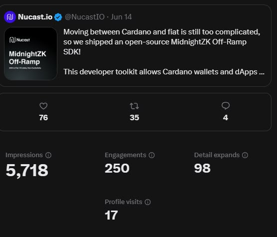
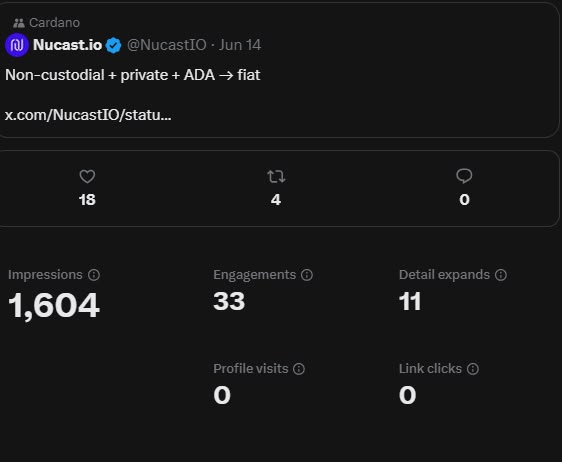
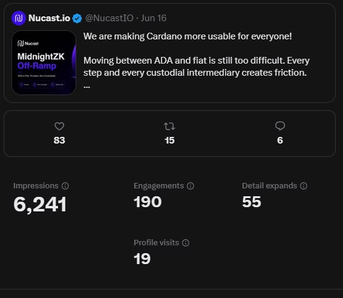
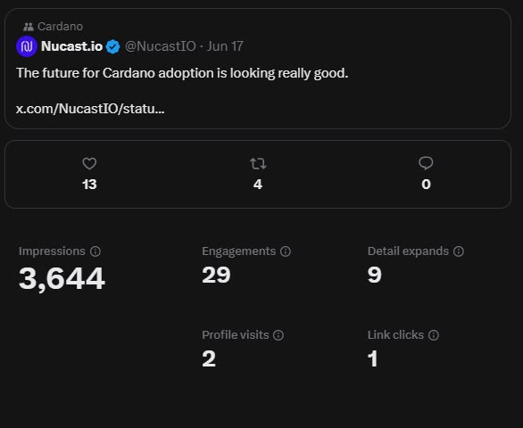
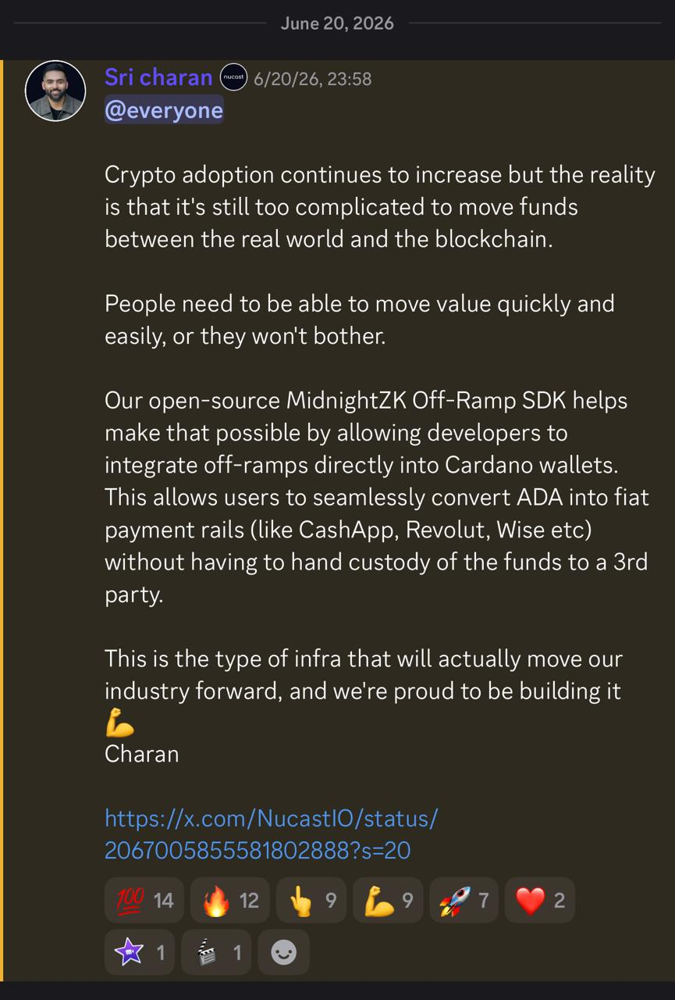

# Community Testing & Marketing Campaign — Engagement Record

Record of the open community testing campaign and SDK launch marketing targeting the Cardano developer community, per the Final Milestone outputs ("Launch SDK marketing campaign … via X/Twitter, Discord, and Cardano Forum; posts and engagement analytics tracked for transparency").

## Campaign posts (5)

| # | Platform | URL / location | Date (2026) | What it promotes |
|---|---|---|---|---|
| 1 | X — [@NucastIO](https://x.com/nucastio) | <https://x.com/nucastio/status/2066109750991867968> | Jun 14 | Launch: "Moving between Cardano and fiat is still too complicated, so we shipped an open-source MidnightZK Off-Ramp SDK!" — repo + docs links |
| 2 | X — @NucastIO | <https://x.com/nucastio/status/2066299179316490341> | Jun 14 | "Non-custodial + private + ADA → fiat" — feature summary + links |
| 3 | X — @NucastIO | <https://x.com/nucastio/status/2067005855581802888> | Jun 16 | "We are making Cardano more usable for everyone!" — friction problem + SDK pitch |
| 4 | X — @NucastIO | <https://x.com/nucastio/status/2067365764110197176> | Jun 17 | "The future for Cardano adoption is looking really good." — follow-up + link |
| 5 | Discord — Nucast community server, `@everyone` announcement by **Sri Charan** | Server announcement channel ([screenshot](evidence/discord-announcement-jun20.jpeg)) | Jun 20, 23:58 | Full launch announcement: problem statement, non-custodial ADA → fiat rails (Cash App / Revolut / Wise), open-source positioning, link to post #3 |

**Meets the ≥5-posts criterion** (4 X posts + 1 Discord announcement), all promoting the SDK release and documentation links.

## Engagement analytics (from X Analytics, captured 2026-07-02)

Per-post metrics read directly from the account's X Analytics panels — screenshots committed under [`docs/evidence/`](https://github.com/Nucastio/MidnightZK-Off-Ramp-SDK-ADA-Web2-Payments/tree/main/docs/evidence):

| Post | Likes | Reposts | Replies | Detail expands | Profile visits | Impressions | X-measured engagements |
|---|---:|---:|---:|---:|---:|---:|---:|
| #1 — Jun 14 launch | 76 | 35 | 4 | 98 | 17 | 5,718 | 250 |
| #2 — Jun 14 non-custodial | 18 | 4 | 0 | 11 | 0 | 1,604 | 33 |
| #3 — Jun 16 usable-for-everyone | 83 | 15 | 6 | 55 | 19 | 6,241 | 190 |
| #4 — Jun 17 adoption | 13 | 4 | 0 | 9 | 2 | 3,644 | 29 |
| **X subtotal** | **190** | **58** | **10** | **173** | **38** | **17,207** | **502** |
| #5 — Discord announcement (reactions: 💯 14 · 🔥 12 · ☝️ 9 · 💪 9 · 🚀 7 · ❤️ 2 · ⭐ 1 · 🎬 1 · 🙂 1) | — | — | — | — | — | — | **56 reactions** |

### Criterion check — minimum 100 total engagements

| Counting method | Total | ≥ 100? |
|---|---:|---|
| **Strict milestone definition** (likes + reposts + replies/comments + reactions): 190 + 58 + 10 + 56 | **314** | ✅ **3.1×** the target |
| X-measured engagements (X Analytics' broader metric) + Discord reactions: 502 + 56 | **558** | ✅ 5.6× |
| Total impressions across the 4 X posts | 17,207 | (reach context) |

## Screenshots (committed evidence)

| File | Contents |
|---|---|
| [`evidence/x-post-1-jun14-launch.jpeg`](evidence/x-post-1-jun14-launch.jpeg) | Post #1 analytics — 76 likes / 35 reposts / 4 replies / 5,718 impressions / 250 engagements |
| [`evidence/x-post-2-jun14-noncustodial.jpeg`](evidence/x-post-2-jun14-noncustodial.jpeg) | Post #2 analytics — 18 / 4 / 0 / 1,604 / 33 |
| [`evidence/x-post-3-jun16-usable.jpeg`](evidence/x-post-3-jun16-usable.jpeg) | Post #3 analytics — 83 / 15 / 6 / 6,241 / 190 |
| [`evidence/x-post-4-jun17-adoption.jpeg`](evidence/x-post-4-jun17-adoption.jpeg) | Post #4 analytics — 13 / 4 / 0 / 3,644 / 29 |
| [`evidence/discord-announcement-jun20.jpeg`](evidence/discord-announcement-jun20.jpeg) | Post #5 — Discord `@everyone` launch announcement by Sri Charan (Jun 20, 23:58) with the full reaction row totalling 56 |

> **Method note.** Public like/repost/reply counts on the four X post URLs are independently verifiable by anyone without an X login. Impressions, detail expands, profile visits, and X's composite "engagements" metric are owner-visible in X Analytics and are evidenced by the committed screenshots above (captured 2026-07-02). Discord reaction counts are read directly from the announcement message.

## Open community testing call

The campaign's call-to-action invites Cardano developers to:

1. Install the SDK from the [v1.0.0 release](https://github.com/Nucastio/MidnightZK-Off-Ramp-SDK-ADA-Web2-Payments/releases/tag/v1.0.0),
2. follow the [quickstart](https://nucastio.github.io/MidnightZK-Off-Ramp-SDK-ADA-Web2-Payments/quickstart/) to stand up the stack locally,
3. run a real Wise-sandbox off-ramp per the [integration guide](https://nucastio.github.io/MidnightZK-Off-Ramp-SDK-ADA-Web2-Payments/integration/), and
4. report issues on the [GitHub tracker](https://github.com/Nucastio/MidnightZK-Off-Ramp-SDK-ADA-Web2-Payments/issues).
