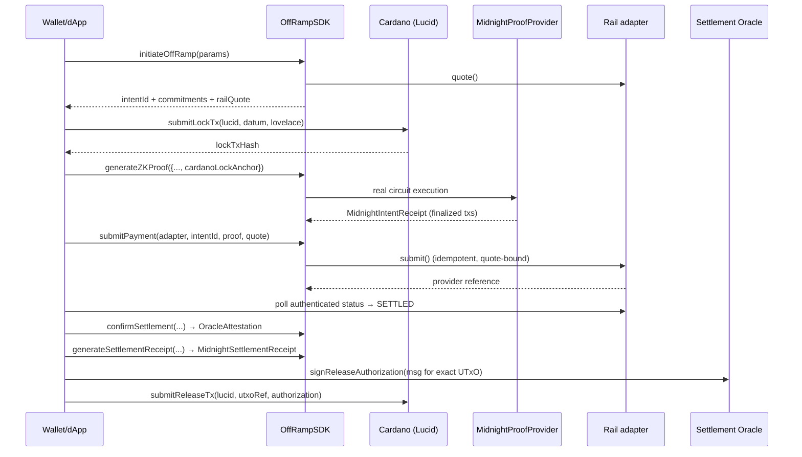

# Integration guide

Step-by-step guide for integrating the **MidnightZK Off-Ramp SDK** into a wallet or dApp.

The SDK is a typed TypeScript surface (`OffRampSDK` + Cardano tx builders) over Cardano + Midnight + rail-adapter modules. The same modules power the bundled Hono backend (`backend/api/`), so an integrator can use the in-process class **or** the HTTP API documented in the [API reference](api-reference.md). Read the [trust model](trust-model.md) first — in particular: Cardano does **not** verify SNARKs directly; release is authorized by the Settlement Oracle's signature.

## 1. Install + configure

```ts
import {
  OffRampSDK,
  createAppLucid,
  paymentPkhFromAddress,
  submitLockTx,
  submitReleaseTx,
  submitRefundTx,
  escrowScriptAddress,
  releaseAuthorizationMessageForUtxo,
  vkHash,
} from "./sdk/src/index.ts";
import { signReleaseAuthorization } from "./sdk/src/oracle/settlement-oracle.ts";
import { createMidnightProofProviderFromEnv } from "./midnight-local-cli/src/index.ts";
import type { RailId, Currency, EscrowDatumIn, EscrowOutRef } from "./sdk/src/index.ts";
```

Set the [environment variables](quickstart.md#2-environment) in your `.env` (Blockfrost project id, mnemonics, oracle signing key, Midnight endpoints, `RAIL_WEBHOOK_HMAC_KEY`).

**The `MidnightProofProvider` is mandatory.** The constructor throws without one, and it rejects any provider whose `artifactManifestHash` differs from the packaged SDK's 23-asset circuit manifest:

```ts
const midnightProofProvider = createMidnightProofProviderFromEnv(); // real node+indexer+proof server
const sdk = new OffRampSDK({ senderPkh, operatorPkh, midnightProofProvider });
```

There is no mock fallback in the production path. A test-only in-memory provider exists under `sdk/src/testing/` for unit tests.

## 2. The off-ramp pipeline

Lifecycle (mirrored by the backend state machine): **Initiate → Lock → Prove → Submit → Settle → Settlement receipt → Release authorization → Release** — with **Refund** as the alternative path at/after the deadline.



### Step 1 — Initiate

```ts
const { initiate, payeeSalt, amountSalt, railQuote } = await sdk.initiateOffRamp({
  adapter: "revolut",
  payeeHandle: "revolut-counterparty",
  amountAda: 2,
  fiatAmount: "1.50",
  fiatCurrency: "GBP",
});
// initiate.intentId, initiate.payeeCommitment, initiate.amountCommitment,
// initiate.adapterTag, initiate.deadline, initiate.vkHash, initiate.escrowLovelace
```

**No on-chain state is created.** Keep `payeeSalt` and `amountSalt` in private state — the prover needs them, and the backend never persists them.

### Step 2 — LOCK ADA on Cardano

`submitLockTx` takes the Lucid instance, a full `EscrowDatumIn`, and the lovelace amount. It validates every field length and refuses to run if the connected wallet's payment key hash differs from `datum.senderPkh`:

```ts
const lucid = await createAppLucid("sender");

const datum: EscrowDatumIn = {
  intentId: initiate.intentId,
  payeeCommitment: initiate.payeeCommitment,
  amountCommitment: initiate.amountCommitment,
  adapterTag: initiate.adapterTag,
  deadline: BigInt(initiate.deadline * 1000),   // POSIX ms
  circuitArtifactHash: vkHash(),                // 23-asset artifact manifest hash
  senderPkh,
  operatorPkh,
  oraclePublicKey: operatorPublicKeyHex(),      // 32-byte Ed25519 oracle key
};

const { txHash: lockTxHash, scriptAddress } = await submitLockTx(
  lucid,
  datum,
  initiate.escrowLovelace,
);
```

The on-chain inline datum fields (matching [`escrow.ak`](https://github.com/Nucastio/MidnightZK-Off-Ramp-SDK-ADA-Web2-Payments/blob/main/cardano/escrow/validators/escrow.ak)) are: `intent_id`, `payee_commitment`, `amount_commitment`, `adapter_id`, `deadline`, `circuit_artifact_hash`, `sender_pkh`, `operator_pkh`, `oracle_public_key`.

### Step 3 — Generate the Midnight intent receipt

```ts
const proof = await sdk.generateZKProof({
  intentId: initiate.intentId,
  cardanoLockAnchor: { txHash: lockTxHash, outputIndex: 0 },
  payeeHandle: "revolut-counterparty",
  payeeSalt,
  fiatAmount: "1.50",
  fiatCurrency: "GBP",
  railQuoteDigest: railQuote.railQuoteDigest,
  principalLovelace: initiate.escrowLovelace,
  amountSalt,
  payeeCommitment: initiate.payeeCommitment,
  amountCommitment: initiate.amountCommitment,
  adapterTag: initiate.adapterTag,
});

await sdk.verifyZKProof(proof, {
  intentId: initiate.intentId,
  cardanoLockAnchor: { txHash: lockTxHash, outputIndex: 0 },
  payeeCommitment: initiate.payeeCommitment,
  amountCommitment: initiate.amountCommitment,
  adapterTag: initiate.adapterTag,
});
```

`proof` is a `MidnightIntentReceipt`: finalized Midnight transaction identifiers (txId/txHash/blockHash/blockHeight) for the deploy, `bindOffRampIntent` (anchored to the Cardano lock tx), `provePayeeBinding`, and `proveAmountBinding` circuits, plus the queried public contract state and a canonical `receiptHash`. `verifyZKProof` checks receipt integrity and re-verifies against the provider; it throws `ProofVerifyError` on mismatch.

### Step 4 — Submit payment via the rail adapter

```ts
const submit = await sdk.submitPayment({
  adapter: "revolut",
  intentId: initiate.intentId,
  proof,
  payeeHandle: "revolut-counterparty",
  quote: railQuote,
});
// submit.providerReference — use it to poll the adapter's authenticated getStatus()
```

Adapter behaviour is selected by `RAIL_ADAPTER_MODE`:

- `sandbox` — real provider HTTP. **Wise**: strict sandbox client (quote-bound transfer, deterministic idempotency, no mock fallback; requires a fresh token). **Revolut**: live-sandbox **verified** — a real sandbox payment completed through this adapter. **Cash App**: implemented against the official Payouts API but **credential-gated** (early-access partner product) — no live evidence until credentials are granted.
- `mock` — deterministic in-process simulators, **test-only**.

### Step 5 — Confirm settlement (adapter-observed) + oracle attestation

Settlement truth comes from the **provider**, not the caller. Poll the adapter's authenticated status (or verify relayed provider webhook bytes via `adapter.verifyWebhook`), and only then attest:

```ts
const observation = await getAdapter("revolut").getStatus({
  intentId: initiate.intentId,
  providerReference: submit.providerReference,
});
// observation.providerStatus: "SUBMITTED" | "PROCESSING" | "SETTLED" | "FAILED"

const attestation = await sdk.confirmSettlement({
  intentId: initiate.intentId,
  railTxRef: observation.railTxRef,
  status: "SETTLED",            // only after the provider observation is terminal
});
```

The bundled backend enforces this server-side: `POST /api/offramp/confirm-settlement` **rejects caller-supplied statuses** outright.

### Step 6 — Midnight settlement receipt

```ts
const settlementReceipt = await sdk.generateSettlementReceipt({
  intentReceipt: proof,
  settlementDigest: attestation.settlementDigest,
});
await sdk.verifySettlementReceipt(settlementReceipt, {
  intentId: initiate.intentId,
  intentReceiptHash: proof.receiptHash,
  settlementDigest: attestation.settlementDigest,
});
```

This runs `proveOffRampSettlement` on the same Midnight contract and returns a finalized, hash-bound `MidnightSettlementReceipt`.

### Step 7 — Oracle-signed release authorization + RELEASE

The release authorization is bound to the **exact escrow UTxO** and verified on-chain by the validator:

```ts
const utxoRef: EscrowOutRef = { txHash: lockTxHash, outputIndex: 0 };
const body = {
  settlementDigest: attestation.settlementDigest,
  midnightSettlementReceiptHash: settlementReceipt.receiptHash,
  authorizationExpiry: BigInt(Date.now() + 10 * 60_000),
};
const message = await releaseAuthorizationMessageForUtxo(lucidOperator, utxoRef, body);
const oracleSignature = signReleaseAuthorization(message); // Ed25519, oracle key

const { txHash: releaseTxHash } = await submitReleaseTx(
  lucidOperator,                          // operator wallet pays fees
  utxoRef,
  { ...body, oracleSignature },
);
```

On-chain the validator checks the oracle signature over datum + spending output reference + settlement digest + settlement-receipt hash + expiry, the operator's signature, a validity window entirely before both the deadline and the expiry, and full-value payout to the datum-bound operator address. The SDK additionally refuses expired authorizations and wrong wallets before submitting.

### Alternative path — REFUND at/after the deadline

```ts
const { txHash: refundTxHash } = await submitRefundTx(lucid, utxoRef);
```

`submitRefundTx` sets the validity window to start at/after the datum deadline (the validator rejects earlier windows) and pays the full escrow value back to the datum-bound sender address. Only the sender's wallet can produce it.

## 3. Using the HTTP backend instead

The bundled backend exposes the same flow with **per-intent capability-token auth**:

1. `POST /api/offramp/initiate` → returns `capabilityToken`, `payeeSalt`, `amountSalt` **exactly once** (only the token's SHA-256 hash is persisted; handles/salts are never stored).
2. All subsequent calls send `X-Capability-Token` (or `Authorization: Bearer`): `lock` → `confirm-lock` → `prove` (client re-supplies handle + salts) → `submit-payment` → `confirm-settlement` (adapter-observed; caller status rejected) → `release` → or `refund`.
3. `release`/`refund` spend only the **stored** lock UTxO reference and datum-bound destinations — caller-supplied `lockTxHash`/`payoutAddress` overrides are rejected.

Full route documentation: [API reference](api-reference.md).

## 4. Webhook + oracle signature verification

```ts
import { verifyAttestation, operatorPublicKeyHex } from "./sdk/src/index.ts";

const sigOk = verifyAttestation(att);   // re-checks the Ed25519 attestation
const pub = operatorPublicKeyHex();     // publish to consumers
```

Provider webhooks are verified by the **adapter** (`verifyWebhook` checks the provider's own signature scheme over the raw bytes). The oracle's Ed25519 secret lives in `OPERATOR_ED25519_SK_HEX` — never commit it; consumers verify with the public key only.

## 5. Where to go next

- [Trust model](trust-model.md) — what each layer proves, and what remains trusted.
- [API reference](api-reference.md) — REST surface with lifecycle + auth details.
- [SDK reference](sdk-reference.md) — exported symbols and exact signatures.
- [Examples](examples.md) — runnable end-to-end scenarios.
