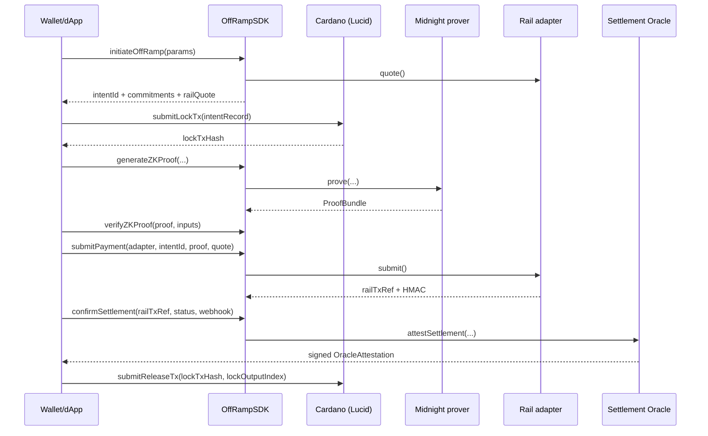

# Integration guide

Step-by-step guide for integrating the **MidnightZK Off-Ramp SDK** into a wallet or dApp.

The SDK is a thin TypeScript surface (`OffRampSDK`) over Cardano + Midnight + rail-adapter modules. The same modules also power the bundled Hono backend (`backend/api/`), so an integrator can talk to either the in-process class **or** the HTTP API documented in the [API reference](api-reference.md).

## 1. Install + configure

Add the SDK to your project (during the milestone, install from a workspace copy or the GitHub source archive at the [v1.0.0 release](https://github.com/Nucastio/MidnightZK-Off-Ramp-SDK-ADA-Web2-Payments/releases/tag/v1.0.0)):

```ts
import {
  OffRampSDK,
  createAppLucid,
  paymentPkhFromAddress,
  submitLockTx,
  submitReleaseTx,
  submitRefundTx,
  escrowScriptAddress,
} from "./sdk/src/index.ts";
import type { RailId, Currency } from "./sdk/src/types.ts";
```

Set the [environment variables](quickstart.md#2-environment) in your `.env` (Blockfrost project id, mnemonics, oracle signing key, etc.).

## 2. The 6-step off-ramp pipeline

The TAD §4 lifecycle is **Initiate → Lock → Prove → Submit → Settle → Release** (with **Refund** as the alternative path after the deadline). The SDK class wires the off-chain steps; Cardano helpers handle the on-chain ones.



### Step 1 — Initiate

```ts
const sdk = new OffRampSDK({ senderPkh, operatorPkh });

const { initiate, payeeSalt, amountSalt, railQuote } = await sdk.initiateOffRamp({
  adapter: "cashapp",
  payeeHandle: "$alice",
  amountAda: 2,
  fiatAmount: "1.50",
  fiatCurrency: "USD",
});
// initiate.intentId, initiate.payeeCommitment, initiate.amountCommitment,
// initiate.adapterTag, initiate.deadline, initiate.vkHash, initiate.escrowLovelace
```

**No on-chain state is created.** Keep `payeeSalt` and `amountSalt` in private state — they're required by the prover.

### Step 2 — LOCK ADA on Cardano

```ts
const lucid = await createAppLucid("sender");      // returns Lucid Evolution bound to the sender mnemonic
const intentRecord = /* compose IntentRecord from `initiate` + ctx; see scripts/preprod-lock.ts */;

const { txHash } = await submitLockTx({ lucid, intentRecord });
// inline EscrowDatum is on-chain at the validator address.
console.log("Script address:", escrowScriptAddress());
```

The Datum shape (`intent_id`, `payee_commitment`, `amount_commitment`, `adapter_tag`, `sender_pkh`, `operator_pkh`, `deadline`, `vk_hash`, `principal_lovelace`) is recorded inline; reviewers can decode it from Cardanoscan.

### Step 3 — Generate the Midnight ZK proof

```ts
const proof = await sdk.generateZKProof({
  intentId: initiate.intentId,
  payeeHandle: "$alice",
  payeeSalt,
  fiatAmount: "1.50",
  fiatCurrency: "USD",
  railQuoteDigest: railQuote.railQuoteDigest,
  principalLovelace: initiate.escrowLovelace,
  amountSalt,
  adapterTag: initiate.adapterTag,
});

await sdk.verifyZKProof(proof, {
  payeeHandle: "$alice", payeeSalt, fiatAmount: "1.50", fiatCurrency: "USD",
  railQuoteDigest: railQuote.railQuoteDigest,
  principalLovelace: initiate.escrowLovelace, amountSalt,
});
```

`verifyZKProof` is the same deterministic re-derive-and-compare the backend runs before submitting payment — call it for defence-in-depth in your client.

### Step 4 — Submit payment via the rail adapter

```ts
const submit = await sdk.submitPayment({
  adapter: "cashapp",
  intentId: initiate.intentId,
  proof,
  payeeHandle: "$alice",
  quote: railQuote,
});
// submit.railTxRef, submit.status === "ACCEPTED" | "REJECTED", submit.webhookHmac
```

Adapter behaviour is selected by `RAIL_ADAPTER_MODE`:

- `mock` — deterministic in-process simulator (used by the internal test suite).
- `sandbox` — real provider HTTP. Wise sandbox is fully wired ([live evidence](sandbox-evidence/README.md)). Cash App uses **Afterpay sandbox** semantics — see the canonical provider reference: <https://www.postman.com/afterpay-1-426879/afterpay-online-apis-v2/folder/zohg5nd/checkouts>. Revolut sandbox is wired to the same interface and ready for credentials.

### Step 5 — Confirm settlement via the Settlement Oracle

```ts
const attestation = await sdk.confirmSettlement({
  intentId: initiate.intentId,
  railTxRef: submit.railTxRef,
  status: "SETTLED",
  webhookPayload: railWebhookBody,   // optional — verifies provider HMAC
  webhookHmac: submit.webhookHmac,
});
// attestation.signature is a 128-hex Ed25519 sig binding intentId + railTxRef + settlementDigest.
```

`confirmSettlement` runs **two checks**: (a) optional adapter-HMAC verification on the rail webhook payload, and (b) self-verification of the produced attestation. Both are documented at `sdk/src/oracle/settlement-oracle.ts`.

### Step 6 — RELEASE on Cardano

```ts
const { txHash: releaseTxHash } = await submitReleaseTx({
  lucid,
  intentId: initiate.intentId,
  lockTxHash: lockTxHash,
  lockOutputIndex: 0,
});
```

The operator's signature satisfies the `Release` redeemer; the escrow UTxO is spent back to the operator's address. A future revision of the validator will additionally verify the ZK proof + Oracle attestation **on-chain** (see [`docs/TAD_v1.1.pdf`](https://github.com/Nucastio/MidnightZK-Off-Ramp-SDK-ADA-Web2-Payments/blob/main/docs/TAD_v1.1.pdf) §5).

### Alternative path — REFUND after the deadline

```ts
const { txHash: refundTxHash } = await submitRefundTx({
  lucid,
  intentId: initiate.intentId,
  lockTxHash,
  lockOutputIndex: 0,
});
```

The sender's signature satisfies the `Refund` redeemer; the LOCK output is spent back to the sender once the deadline has elapsed.

## 3. Webhook + Oracle signature verification

Rail adapters return an HMAC of the canonical webhook payload (`webhookHmac`). `confirmSettlement` verifies this before signing the attestation:

```ts
import { verifyAdapterWebhook, verifyAttestation, operatorPublicKeyHex } from "./sdk/src/oracle/settlement-oracle.ts";

const ok = verifyAdapterWebhook(payload, hmac);          // bool
const att = await sdk.confirmSettlement({ ... });
const sigOk = verifyAttestation(att);                    // bool — re-checks Ed25519
const pub = operatorPublicKeyHex();                      // 64-hex — publish to consumers
```

The operator's Ed25519 secret key lives in `OPERATOR_ED25519_SK_HEX`. **Never commit it.** Consumers verify attestations using only the public key.

## 4. Where to go next

- [API reference](api-reference.md) — REST surface (`/api/offramp/*`) if you'd rather call the bundled backend.
- [SDK reference](sdk-reference.md) — every exported symbol from `sdk/src/index.ts`.
- [Examples](examples.md) — three runnable end-to-end scenarios.
- [Architecture](architecture.md) — the protocol picture (TAD §3).
